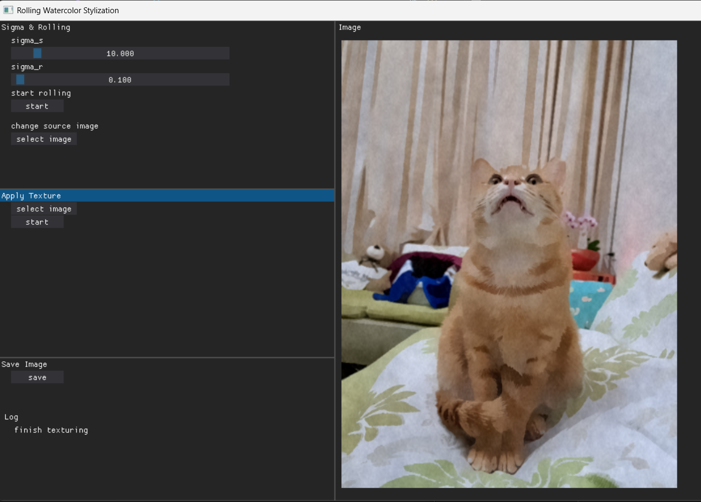

# Rolling Watercolor Stylization


We stylize your picture into a watercolor-paint-like style!


### How to Download this?
1. Download the whole project by "Code > Download ZIP" or `git clone` it
2. Make sure you have [Python](https://www.python.org/downloads/)
3. Make sure you `pip install`'d below packages:
    ```
    pip install numpy 
    pip install dearpygui
    pip install opencv-contrib-python

    // or

    pip install -r requirements.txt
    ```
    - If `opencv-python` is installed, please uninstall it first. Only one opencv version can be in python.
        ```
        pip uninstall opencv-python 
        ```
        `opencv-contrib-python` provides all of the `opencv-python` functions with extra modules.
4. Run the program:
    ```
    python main.py
    ```
### Tips
1. **Apply Texture** section paints your result on a paper texture
    
    Press **select image** button to select your paper image
      - The lower resolution paper image, the coarser the paper looked like in final result. 
      - You can try doing Texture Synthesis to increase image resolution without scaling side effect. Here is a good implement: https://github.com/rohitrango/Image-Quilting-for-Texture-Synthesis 
    
    If you don't have paper image, you can press **start** without **select image**. We will generate a paper-like noise map for you. 
2. Adjusting **sigma_s** and **sigma_r**
 
    **sigma_s** decides how blurry the image is.  The bigger value, the blurrier color lumps.   
    **sigma_r** decides where are the edges of color blocks. The bigger value, the more differnece between edges are needed to preserve the edge, i.e. *the blurrier at edges*.  
### How Stylization is Done?
Color block effect is done by applying [Rolling Guidance filter](https://www.cse.cuhk.edu.hk/leojia/projects/rollguidance/) to source image.

There are 2 approaches when applying Paper Texture:
1. Have Paper Image:  
   Scaling result image by grayscale value of paper image, then do [gamma correction](https://en.wikipedia.org/wiki/Gamma_correction) to brighten the result back. gamma is $1.2$, fixed.
2. Don't have Paper Image:  
   Generate a noise texture by sampling Standard Normal Distribution to a small area, scale it to result image size, then do same sampling and scaling  multiple time but to a bigger and bigger area, finally add all areas in to one. This generated texture is directly added to result image and  colors' value are clipped back to $[0,255]$.
